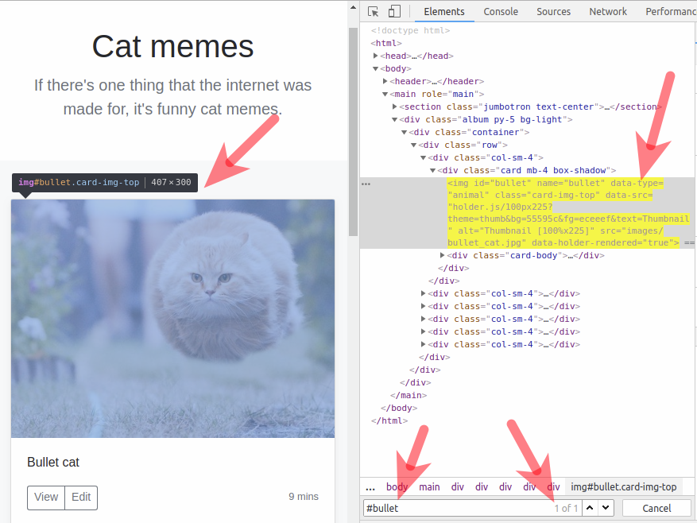

## Finding elements with CSS selectors

<p> Below you can see the parts of an HTML page we can use to find an element with the help of the CSS syntax:</p>

<ul>
    <li>tag</li>
	<li>id</li>
	<li>name</li>
	<li>class</li>
    <li>value of any other attribute</li>
</ul>

Let's open the page http://suninjuly.github.io/cats.html and try to find the element containing the picture with the 
Bullet cat.
Below you can see a simplified fragment of the page's HTML code:

```
<div class="col-sm-4">
  <div class="card mb-4 box-shadow">
    
  </div>
</div>
```

First, we'll try manual search with the browser console,
and in the following lesson, we'll learn how to write code that performs the same search task. 

### Search by id

Lucky we are! The element with our picture has an attribute `id="bullet"`, which means
we can unmistakably find it using the `#bullet` selector. 

**In the CSS syntax, `#` signifies search by the element's id**




We can check whether we've chosen the proper selector right in your browser's developer console.
Open the developer console and go to the Elements tab. 
Press ctrl+F and enter the selector in the opened search field at the bottom.
If the selector was written correctly, you will see a highlighted element in the web page
and a yellow-marked element in the HTML code. 
Besides, you will see the number of found elements in the search field.
It's preferable to write accurate selectors, which allow finding exactly one element.
We'll practice writing such selectors in one of the following tasks.

### Search by tag

To find an element by its tag, just type the name of the tag in the search field, like we did in the id search
(only without the # sign), for example, `h1`.
The search by `h1` will give us the element with the page heading.
Searching by tag is not very convenient
because developers use a limited number of markup tags 
and most probably one tag will match numerous elements.

### Search by attribute value

We can find an element by indicating the name of an attribute and its value.
For example, we can rewrite the id search in the following way: `[id="bullet"]` instead of `#bullet`.

It's better to use the format with square brackets in the attribute value search when the attribute does not have its own short search command. For example, let's find the h1 element by the value of its attribute: [value="Cat memes"].

### Search by name

This is a variety of attribute value search, and it's written in the same way: [name="bullet-cat"]. We discuss it separately because it is frequently used and also considered a separate kind of element search in Selenium WebDriver.

### Search by class

You can search by class in the following way: `[class="jumbotron-heading"]`
because class is also an element's attribute.
However, as classes are used in literally all pages to define page styles,
there is also a short version of search for them:
`.jumbotron-heading`. 
That is, we write the name of the class preceded by a dot.

Now, let's look into the important difference between the two class searches.
Let's say the element "article" has more than one class,
like in the page http://suninjuly.github.io/cats.html:

``` 
<article id="moto" class="lead text-muted" title="one-thing" name="moto">If there's one thing that the internet was made for, it's funny cat memes.</article> 
```

The `[class="lead"]` variant won't find the element because it requires an exact match.
In order to find the element, we need to write `[class="lead text-muted"]`,
minding the order of classes: `[class="text-muted lead"]` will not find the element in question.

Meanwhile, the `.lead` variant will allow us to find the element because it searches for
mere presence of the class in the element. 
To refine the selector, we can also mention both classes,
that is, add the second class in the search field without a space and preceded by a dot:
`.lead.text-muted`. 
Unlike the previous case, the order of classes does not matter here — `.text-muted.lead`
will also find the needed element.
We recommend using the latter method of searching by class, as it is more flexible.

One more important thing. Search by class is case-sensitive, 
so `.Lead` will not find the element.

In the browser console, you can also search by the text match in HTML,
for example, the search for "lead" will highlight the text "lead".
However, it's not advisable to use such a method for selecting elements because 
it is too general and cannot be used as a selector.

We've discussed various ways of writing the path to a page element using the CSS syntax,
that is, we've learned to write CSS selectors.


Next, we'll learn to find elements by combining the methods of selector writing
discussed in this step.
