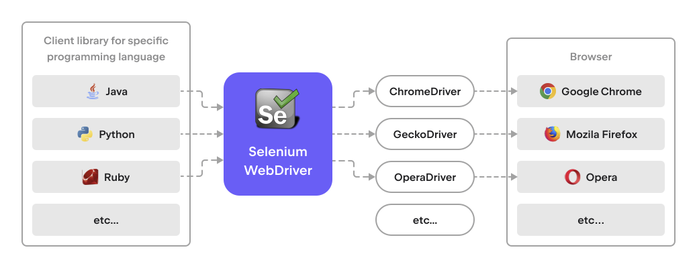

# What is Selenium WebDriver? 
There are different kinds of automated tests; they check different things and work with different application levels. 
You must have previously seen the so-called "testing pyramid". 
In our course, we'll mostly talk about the end-to-end tests,
i.e., those that check the entire work of the system and simulate the user's actions. 

What do we need to write such a test for a web application? 

Apparently, we need some code in a programming language.
It will contain a certain logic of events 
(for example: log the user in, add an item to the shopping cart, etc.) and some tests.
To simulate the actions of the user, you will need a browser. 
Preferably, a popular one, and even better – several browsers. 
These two parts need to be linked in some way, and 
that's what we need Selenium WebDriver for. 
Technically, it's a universal interface
that allows manipulating different browsers directly from the code, using a programming language.
Its advantage is its versatility: with a very few exceptions, 
all the tests we write may be run for different browsers.

There's another side to its versatility, too: the browser will perform the same actions,
no matter what programming language was used to invoke these methods.
Actually, Selenium WebDriver supports a lot of programming languages,
though most popular in the industry are Java and Python.

In this course, we'll study Selenium WebDriver,
and in the tests, we'll use the term WebDriver.
However, if you search for some information
related to Selenium WebDriver online, you will most probably see
that a more general name Selenium is used.
You will need to consider the context to understand what 
part of the Selenium project is meant.

Thus, we get the following picture:

 

It's a "many-to-many" relation.

What's important here? 
As all browsers work slightly differently,
browser developers create their own drivers – 
programs that allow the Selenium interface to manipulate buttons,
texts, elements, etc. 

In this course we will use this set of tools: 

Here's an interesting fact!
WebDriver has become so popular
that it's now recognized as the standard of a browser interaction protocol.
https://www.w3.org/TR/webdriver1/
https://www.selenium.dev/documentation/webdriver/
