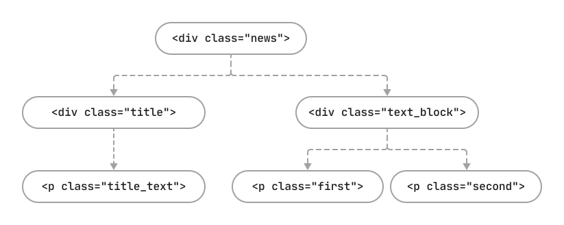

## HTML markup language 
We'll need to know three features of the HTML language:
<ol>
<li>An HTML page consists of elements; all elements are defined by 
a start and an end keywords, or tags. </li>
<li> Tags have attributes, which define the properties of elements. </li>
<li> An HTML page has a hierarchical structure.  </li>
</ol>

### 1. Tag – element description
Elements are enclosed between special keywords, or tags.
Tags are designed to define the type of information they represent
(image, text, block, link, etc.) For example:

`<p>Here goes some text.</p>`

Here the element is defined by an opening tag (`<p>`) and a closing tag (`</p>`);
between the tags is the text the user will see. Some tags don't require 
a closing tag – the opening one is enough. For example, the following tag:

`<br>`

It is a line break tag, it does not contain any text or enclosed element.

### 2. Attribute – element properties

We can define various standard properties for elements,
as well as create our own properties, or attributes.
Attributes are usually defined in the following way: `attribute="value"`.
Sometimes, the "=" sign and the value may be skipped, or the value may be an empty string: `attribute=""`.

In the example below, besides the tags and text, we also have the `href` attribute, 
which defines the address the link in the `<a>` tag goes to.

`<a href="/about">See more details</a> `

Let's talk about a few other important attributes, which will help us find elements. 

**class attribute**

In the example below, we see another important attribute – class. 
Two classes are specified for the element: simple-text and main. 
Classes are mostly used to define formatting rules with CSS:

`<div class="simple-text main">Here goes a text.</div>`

**name attribute**

The name attribute is used, for example, as an anchor or a bookmark in an HTML page.
This attribute may also be used as a selector in element searching:
```
  <a name="top"></a>
  <p>Long text</p>
  ...
  <p><a href="#top">Go up</a></p> 
```

**id attribute**

In the example below, we have a new attribute – id, a unique identifier of an element. 
In the general case, the id value should be unique within the web page:

`<button id="save_button">Save</button>`

**Important**. In modern JavaScript frameworks, id attributes are mostly generated dynamically,
so they change each time the page is reloaded and look obscure: for example, you can come across
something like `id="u_ps_0_0_n"` or `id="avadspffd"`. 
In such cases, you will need to use different selectors or your own attributes, which we will discuss later.
Class names may also be generated automatically. That's why we suggest
that you follow a simple rule:
if you see an unintelligible value of an attribute or if the attribute value changes each time the page is reloaded,
do not use it in element searches.

### 3. Hierarchy in HTML Documents

An HTML document is often compared with a family tree with parents,
children, siblings, ancestors, and descendants. 
Such a comparison is legitimate due to the possibility of nesting elements in other elements. 
Nested (child) elements may also, in their turn, contain child elements, so the depth of
element nesting may be unlimited.


Let's figure out the terminology of such a tree:

- descendant of element X – an element of any nesting level inside element X;
- child element — a direct descendant (i.e., an element at the first level of nesting);
- ancestor of element Y – any element X that contains element Y;
- parent — a direct ancestor (i.e., an element at exactly one level above);
- sibling, or neighbor element – element X located at the same hierarchy level as element Y. Elements X and Y have the same parent.

Now, let's practice the terminology with an example. Let's take such HTML code:

```
<div class="news">
  <div class="title">
    <p class="title_text">Selenium 4alpha is out now</p>
  </div>
  <div class="text_block">
    <p class="first">3 years after its major release, now Selenium has put out its first alpha version of Selenium 4 on Apr 24, 2019.</p>
    <p class="second">If you want, you can get your hands dirty with Selenium 4 and its features by downloading the dependencies from Maven Repository.</p>
  </div>
</div>
```
Now, let's draw a flowchart of that HTML code where each block will correspond to one HTML element.



Which elements are descendants of the element with class="news"?
These are all the rest elements in the HTML code: the element with class="title", 
the element with class="title_text", and others. <br>
Which elements are child elements for the element with class="news"?
Only the elements with class= "title" and class="text_block". <br>
Which elements are ancestors of the element with class="first"? These are the elements with class="text_block" and class="news". <br>
Which element is the parent of the element with class="first"? Only the element with class="text_block". <br>
Which element may be called a sibling of the element with class="first"?
That's the element with class="second". <br>

This theory will help us apply a powerful mechanism of element search with CSS selectors.
