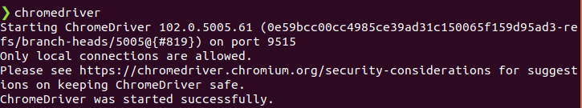

## Installing the driver for the browser: Linux
Let's install and set up ChromeDriver with terminal commands.
We need to define the version of ChromeDriver we need to download.
To get the link, use the browser to go to the necessary driver version 
at https://sites.google.com/chromium.org/driver/. 
When the page opens, right-click the file for Linux and
copy the path to the file. 
In the example below, replace the file path for the wget command with your link:

``` 
wget https://chromedriver.storage.googleapis.com/102.0.5005.61/chromedriver_linux64.zip
unzip chromedriver_linux64.zip
```
Move the unarchived file with ChromeDriver to the `/usr/local/bin/` folder and grant the permission to launch
chromedriver as an executable file:
```
sudo mv chromedriver /usr/local/bin/chromedriver
sudo chown root:root /usr/local/bin/chromedriver
sudo chmod +x /usr/local/bin/chromedriver
```
Check that chromedriver is available by running the command "chromedriver" in the terminal; you need to receive a message saying that the process has been successfully launched:



