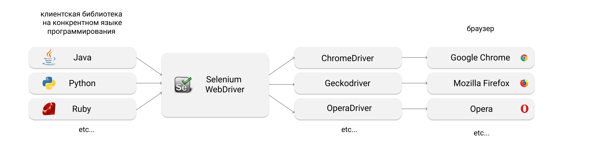
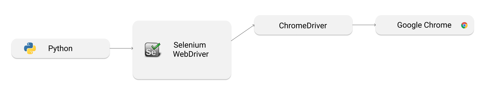

# Что такое Selenium WebDriver? 
Автотесты бывают очень разными, проверяют разные вещи и работают для разных уровней приложения. 
Наверняка вы не раз видели так называемую "пирамиду тестирования". 
В нашем курсе мы в основном будем говорить про end-to-end тесты,
то есть такие, которые проверяют полную работу системы и имитируют действия пользователя. 

Что нам нужно для того, чтобы написать такой тест для веб-приложения? 

Очевидно, код на языке программирования.
Там будет содержаться какая-то логика действий 
(например: залогинить пользователя, добавить товар в корзину) и проверки.
Браузер, чтобы имитировать действия пользователя. 
Желательно, какой-нибудь популярный. А еще лучше — несколько. 
Эти две части нужно как-то связать воедино. 
И как раз для этого нужен Selenium WebDriver. 
По сути своей это — универсальный интерфейс, 
который позволяет манипулировать разными браузерами напрямую из кода на языке программирования.
Его крутость как раз в его универсальности: за некоторыми исключениями, 
все наши тесты, написанные один раз, можно запускать для разных браузеров.

Верна универсальность и в другую сторону: браузер будет выполнять одинаковые действия,
не важно из библиотеки какого именно языка программирования эти методы будут вызваны.
Вообще-то, Selenium WebDriver поддерживает довольно много языков программирования,
хотя наибольшей популярностью в индустрии пользуются Java и Python.

В этом курсе мы будем изучать именно Selenium WebDriver,
и в текстах будем использовать термин WebDriver.
Однако, если вы будете искать в интернете какую-то информацию,
связанную с Selenium WebDriver, то скорее всего увидите,
что используется более общий термин Selenium.
Вам нужно будет смотреть на контекст, чтобы определить,
какая часть проекта Selenium имеется в виду.

Итого получаем вот такую картинку:

 

Это такое отношение "многие ко многим".

Что здесь еще важно? 
Так как все браузеры работают слегка по-разному,
разработчики браузеров самостоятельно реализуют "драйвер" – 
программу, которая позволяет интерфейсу Selenium манипулировать кнопками,
текстами, элементами и т.д. 

В этом курсе мы будем работать со следующим набором инструментов: 

Интересный факт!
WebDriver стал настолько популярен, 
что его признали стандартом протокола взаимодействия с браузером.

Подробнее можно почитать посты Алексея Баранцева: они хоть и старые, все еще хорошие. Он сейчас – один из тех разработчиков, кто вносит вклад в проект Selenium.
