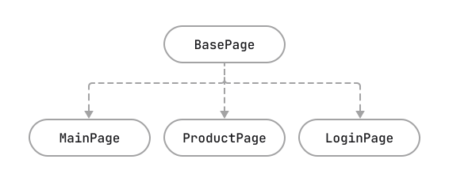

<h2>Benefits of Inheritance: The Magic of OOP</h2>

If you've previously used the OOP paradigm in your code, you likely appreciate the ways good architecture can make life easier. In this regard, test automation code is no different from application code—we can use the same techniques to organize methods.

Here, we will explore just one example: the use of the inheritance mechanism.

We've already used the inheritance mechanism a bit when we created a base class for all our checks, BasePage, and inherited all other Page Objects, such as LoginPage and MainPage, from it. Currently, our BasePage class mainly contains technical details—the implementation of element search and methods for opening pages and handling the captcha. However, there's nothing stopping us from adding elements and methods that are common to all pages.

<h3>&nbsp;</h3>

<strong>Important! </strong>There's no need to stuff everything that might come in handy someday into the base class. Only add what is ABSOLUTELY necessary for each inheriting page; otherwise, there's a risk that the increase in code lines in the file will be uncontrollable, making maintenance challenging.

In general, we can build any hierarchy of our classes to interact with the web application if it helps avoid code duplication. For instance, if there's a set of pages with common methods, we can organize them through inheritance with an additional "layer".

For example, when testing a lesson page in Hyperskill, we use LessonPage as the base class, containing common elements and methods for all types of steps (header, sidebar schedule) and a subclass for each type of task. Such an approach helps avoid code duplication and the need to maintain a file with over 1000 lines of code.

