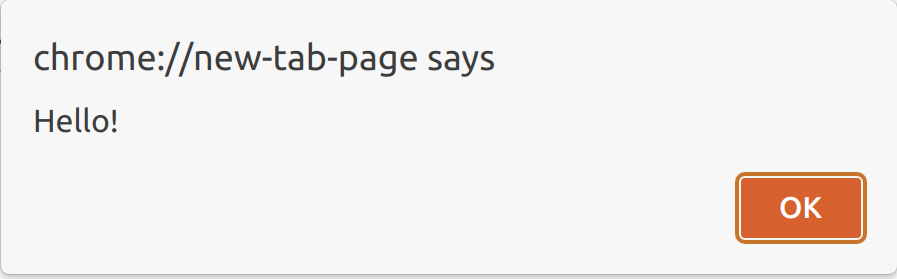
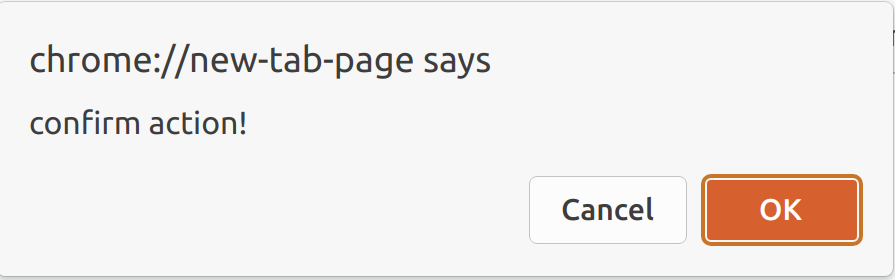
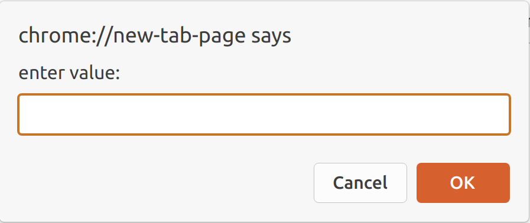

<h2>Alerts and how to deal with them</h2>

We've already come across alerts in our course when we got a solution number in our tasks. We also already know that we can trigger alerts with JavaScript:

<pre><code class="language-javascript">alert('Hello!');</code></pre>

Now, let's consider a situation where the test scenario requires not only getting the alert content but also clicking the OK button to close the alert. <strong>Alert</strong> is a modal window: the user cannot further interact with the interface until they close the alert. To do that, we first need to switch to the alert window and then accept it with the <strong>accept()</strong> command:

<pre><code class="language-python">alert = browser.switch_to.alert
alert.accept()</code></pre>

To get the alert text, use the text  property of the alert object:

<pre><code class="language-python">alert = browser.switch_to.alert
alert_text = alert.text</code></pre>

Another kind of modal window, which offers the user a choice either to agree with the message or dismiss it, is called <strong>confirm</strong>. To switch to the confirm<strong> </strong>window, we use the same command as in the alert case:

<pre><code class="language-python">confirm = browser.switch_to.alert
confirm.accept()</code></pre>

To dismiss the confirm window, we can use the following method:

<pre><code>confirm.dismiss()</code></pre>

It equals the user's clicking the "Cancel" button. 

The third kind of modal windows — <strong>prompt </strong>— has an additional field for entering text. To enter text, use the <strong>send_keys()</strong> method:

<pre><code class="language-python">prompt = browser.switch_to.alert
prompt.send_keys("My answer")
prompt.accept()</code></pre>

