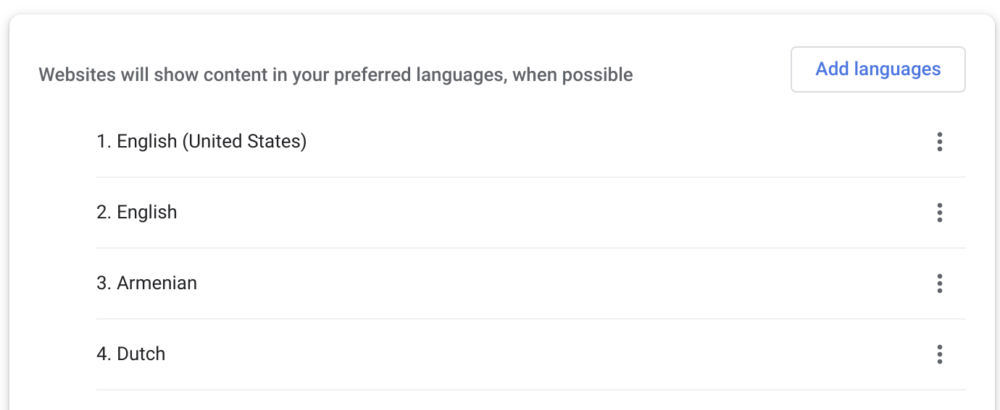

<h2>Running automated tests for different interface languages</h2>

Our goal is to learn to run automated tests for different local settings, i.e., different interface languages.

In one of our previous <a href="/lesson/237240/step/2" rel="noopener noreferrer nofollow">steps</a>, we've already run automated tests for various languages. We used parametrization with different links, but such an approach is hard to scale up onto a large number of tests. Let's make the server decide what interface language to use depending on the browser data. The browser sends the information about the user's language via requests to the server, indicating the <strong>accept-language</strong> parameter in the header. If the server receives a request with the header {accept-language: ru, en}, it will display the Russian-language site interface. If Russian is not supported, the next language in the list will be used – in our case, English. That is actually similar to defining the preferable language in your browser's settings: 

See more: https://developer.mozilla.org/en-US/docs/Web/HTTP/Headers/Accept-Language 

To choose the browser's language with WebDriver, use the Options class and the <strong>add_experimental_option</strong> method, like in the example below:

<pre><code class="language-language-python language-python">from selenium.webdriver.chrome.options import Options

options = Options()
options.add_experimental_option('prefs', {'intl.accept_languages': user_language})
browser = webdriver.Chrome(options=options)
</code></pre>

In the case of Firefox, language selection will look slightly different:

<pre><code class="language-language-python language-python">fp = webdriver.FirefoxProfile()
fp.set_preference("intl.accept_languages", user_language)
browser = webdriver.Firefox(firefox_profile=fp)
</code></pre>

<em>You can add different arguments to the webdriver.Chrome or webdriver.Firefox constructor, which expands the opportunities for testing your web applications: tou can define a proxy server for network traffic control or start different browser versions, indicating the local path to the browser file. We expect that later you will need these options and that you will be able to find the respective settings.</em>

