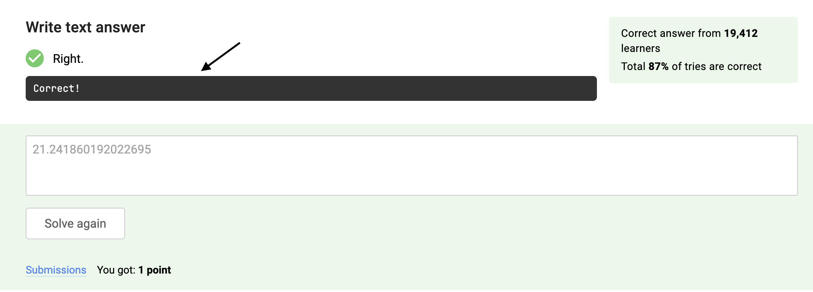

<h2>Task: test parametrization</h2>

Aliens leave mysterious messages on Stepik as feedback for correctly solved tasks. We managed to localize several task URLs where fragments of these messages appear. Your task is to implement an automated test with the following steps:

<ul>
	<li>open the page </li>
	<li>get authorised with your credentials (use the code from the previous step) </li>
	<li>enter the correct answer to the task</li>
	<li>press the 'Submit' button </li>
	<li>wait until the correct feedback is presented </li>
	<li>check that the text in the feedback is <strong>"Correct!"</strong></li>
</ul>

The feedback is the following text against the dark background: 

The correct anser to the task is the following number:

<pre><code>
import time
import math

answer = math.log(int(time.time()))
</code></pre>

Use <strong>pytest</strong> parametrisation and pass this links as parameters to your test case: 

https://stepik.org/lesson/236895/step/1 
https://stepik.org/lesson/236896/step/1 
https://stepik.org/lesson/236897/step/1 
https://stepik.org/lesson/236898/step/1 
https://stepik.org/lesson/236899/step/1 
https://stepik.org/lesson/236903/step/1 
https://stepik.org/lesson/236904/step/1 
https://stepik.org/lesson/236905/step/1

Use correct error messages in assertions and configure waits. 

In the failed tests, find fragments of the aliens' message. The test should fail if the text in the optional feedback does not match the string "Correct!"
Collect the fragments of the text into one sentence and submit it as a string in the answer.py file. 

<strong>Important! </strong>
To complete this task, make sure you have the correct local time set (<a href="https://time.is/" rel="noopener noreferrer nofollow">https://time.is/</a>). Additionally, each task's answer needs to be recalculated separately, as they become outdated otherwise. 

